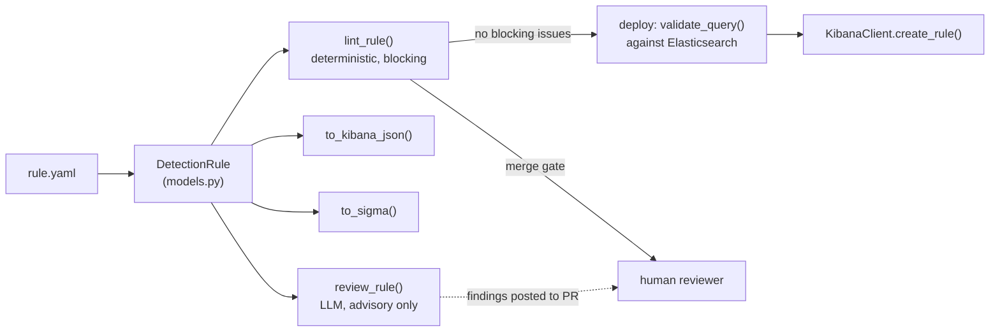

# Architecture

One schema, multiple backends. A rule is authored once as YAML and never
hand-translated into a vendor format:

## Why the split between `validators.py` and `ai_review.py`

`lint_rule()` is what a CI merge gate should be built on: every check is
reproducible, explainable from source, and has zero false-refusal risk. It
catches the mechanical stuff - empty queries, missing index patterns, unsafe
filenames, missing ATT&CK mapping.

`review_rule()` catches the stuff a linter structurally cannot: whether the
query actually covers the attacker behavior it claims to, whether the
description gives an analyst enough to triage on, whether there's an
obvious evasion. That needs judgment, so it goes to an LLM - but it is
**advisory only**. It cannot edit, approve, or deploy a rule, and its output
never participates in the merge gate. See [threat_model.md](threat_model.md)
for why that boundary is enforced in code, not just convention.

## Why Sigma export can fail loudly

`to_sigma()` only accepts simple `field:value AND field:value` Kuery. Kuery
supports arbitrary boolean grouping that Sigma's `detection` block doesn't
map onto 1:1. Rather than guess at a translation that might silently change
match semantics, `to_sigma()` raises `UnsupportedQueryError` and asks for a
manual conversion. A converter that's honest about its limits is more
trustworthy than one that always "succeeds."
